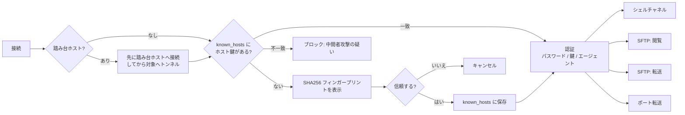
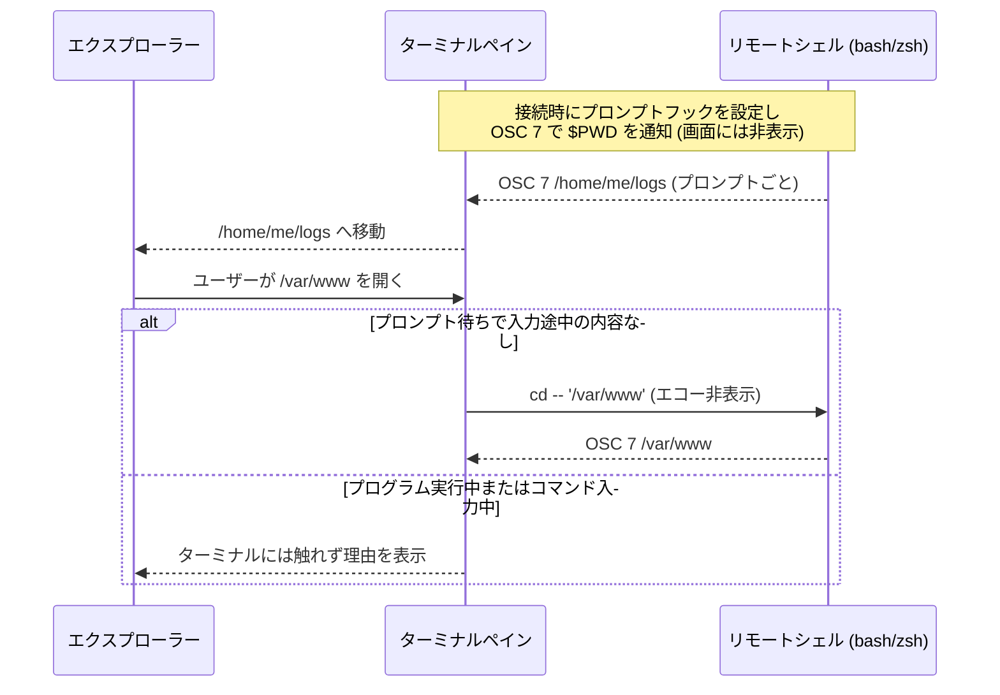

<div align="center">
  
  <br/>
  <h1>JeopsokHeyou</h1>

  <p><strong>Windows・macOS 向けのタブ型 SSH ターミナル + SFTP エクスプローラー — エクスプローラーはシェルに、シェルはエクスプローラーについていきます。</strong></p>

  <p><a href="README.md"></a>&nbsp;<a href="README.ko.md"></a>&nbsp;<a href="README.ja.md"></a></p>

  <p>
    <a href="https://github.com/seunghunjun/JeopsokHeyou/releases/latest"></a>
    <a href="https://github.com/seunghunjun/JeopsokHeyou/actions/workflows/ci.yml"></a>
    
    
    
    
  </p>

  
</div>

<br/>

JeopsokHeyou(ジョプソクヘユ、韓国語で「つなごうよ」をくだけて言った言葉)は、PuTTY・Tabby・MobaXterm・Termius を
使いながら、ファイルを動かすたびに別のプログラムを開いていた方のための軽量な SSH/SFTP クライアントです。
アカウントも、利用状況の収集も、クラウドもありません。

## ✨ 機能

アカウント不要の無料オープンソース(GPL-3.0)です。

- **🏠 ホーム画面** — 最近のセッションが並ぶスタート画面と、ホスト・キーチェーン・ポート転送・スニペット・既知のホスト・履歴のメニュー。
- **🗃️ ホスト画面** — グループとホストをツリーとカードで表示し、クリックで移動できるパス(*すべてのホスト › Production › DB*)、検索、各所の右クリックメニュー、右側の編集パネルを備えます。検索欄に `user@host` と入力して Enter ですぐ接続できます。
- **📁 グループとサブグループ** — グループの中に好きなだけグループを作り、セッションをドラッグでグループ間に移動できます。ターミナルタブの横には折りたためるセッション一覧があります。
- **🗂️ ターミナル + SFTP を並べて表示** — 接続タブごとにシェルの隣へリモートのファイルエクスプローラーを表示します。
- **🔗 フォルダー位置の双方向同期** — ターミナルで `cd` するとエクスプローラーがついていき、エクスプローラーでフォルダーを開くとターミナルが静かに `cd` します(bash/zsh)。実行中のプログラムや入力途中のコマンドには割り込みません。
- **🖱️ 双方向のドラッグ&ドロップ** — エクスプローラー/Finder からドロップでアップロード、リモートのファイルをフォルダーウィンドウやデスクトップへドラッグでその場所にダウンロード。既存のファイルは上書き前に確認します(上書き / スキップ / キャンセル)。進捗表示とキャンセルに対応したバックグラウンド転送で、列幅を調整すると記憶します。
- **✏️ リモートファイルをローカルで編集** — ダブルクリックでいつものアプリで開き、保存すると再アップロードするか確認します(内容が実際に変わった場合のみ)。「プログラムから開く」にも対応。
- **🪟 タブと画面分割** — 同じ接続で左右・上下に分割し、分割したペインはワンクリックで閉じられます。
- **🔀 ポート転送** — ローカル(`-L`)、リモート(`-R`)、ダイナミック SOCKS4/5(`-D`)。セッション接続時に一緒に開くことも、ターミナルなしでトンネルとして動かし続けることもできます(自動開始・自動再接続・接続数のリアルタイム表示)。
- **🪜 踏み台ホスト** — 1 台以上の踏み台サーバー(ProxyJump)を経由して接続します。ターミナルとトンネルの両方に対応。
- **🔐 任意のマスターパスワード** — 既定はオフ。有効にすると保存したパスワードと鍵のパスフレーズをマスターパスワードで暗号化(AES-256-GCM + scrypt)し、一度だけ表示される回復キーと、未使用時の自動ロックを提供します。
- **🔑 キーチェーン** — SSH 鍵と保存済みパスワードを一か所で確認し、ed25519 鍵の生成と公開鍵のコピーができます。
- **⌨️ スニペット** — よく使うコマンドを保存し、ターミナルに貼り付けたりすぐ実行したりできます(Ctrl+Shift+P)。
- **📥 ワンクリック読み込み** — **PuTTY**、**Tabby**、**MobaXterm**(MobaSSHTunnel のトンネルを含む)、**OpenSSH config** ファイル。**Termius** のホストもこの方法で移せます。
- **⏱️ 未使用時の自動切断** — セッション単位または全体で設定、切断 1 分前に警告、ファイル転送中は切断しません。
- **🛡️ 既定で安全** — ホスト鍵の検証(初回接続時に確認、変わったらブロック)と既知のホスト画面、パスワードは求められたときだけ保存、秘密鍵はパスのみ保存します。
- **🎨 Finder 風の UI** — ライト/ダークテーマ、くっきりしたベクターアイコン、韓国語の手書きフォント(Gaegu)も選べます。
- **🌐 英語・韓国語・日本語** — システムの言語に従い、設定からいつでも変更できます。
- **🍎 どちらのプラットフォームでも自然に** — macOS では ⌘ ショートカット・キーチェーン・Finder、Windows ではエクスプローラー・DPAPI・ユーザー単位のインストールを使います。

## 📸 スクリーンショット

<table>
  <tr>
    <td width="50%"><br/><sub><b>ホーム</b> — ホスト、グループ、すべてのツールを一つのメニューに</sub></td>
    <td width="50%"><br/><sub><b>ターミナル + エクスプローラー</b> — 1 タブ、1 接続、2 つのビュー</sub></td>
  </tr>
  <tr>
    <td width="50%"><br/><sub><b>フォルダー同期</b> — シェルで <code>cd logs</code>、エクスプローラーはもうそこに</sub></td>
    <td width="50%"><br/><sub><b>ポート転送</b> — ローカル・リモート・SOCKS トンネル</sub></td>
  </tr>
  <tr>
    <td width="50%"><br/><sub><b>画面分割</b> — 左右・上下の入れ子分割</sub></td>
    <td width="50%"><br/><sub><b>ダークモード</b> — システム設定に従うか自分で選択</sub></td>
  </tr>
</table>

<sub>スクリーンショットは英語の UI で撮影しています。実際のアプリは日本語で表示されます。</sub>

## 📦 インストール

[Releases](https://github.com/seunghunjun/JeopsokHeyou/releases) ページからダウンロードできます。ダウンロードしたファイルを確認できるよう
`SHA256SUMS.txt` も一緒に公開しています。

### Windows 10 / 11

- **インストーラー:** `JeopsokHeyou-<バージョン>-setup.exe` — 英語・韓国語・日本語から選択。管理者権限なしで
  ユーザー単位に `%LOCALAPPDATA%\Programs\JeopsokHeyou` へインストールします。
- **ポータブル:** `JeopsokHeyou-<バージョン>-win-x64.zip` — 展開して `JeopsokHeyou.exe` を実行します。
- **アップデート:** 新しいインストーラーをそのまま実行すると旧バージョンに上書きされます。セッション・保存したパスワード・設定は残ります。
  JeopsokHeyou が実行中の場合は、インストーラーが先に終了するよう案内します。

> **SmartScreen:** まだコード署名されていないため「Windows によって PC が保護されました」と表示されることがあります。
> このリポジトリの Releases ページから入手したファイルの場合のみ *詳細情報 → 実行* を選んでください。
> 会社の PC では署名のないインストーラーが完全にブロックされることがあります。その場合はポータブル ZIP を使うか、IT 担当者にご相談ください。

### macOS 13 Ventura 以降

- Apple シリコンは `JeopsokHeyou-<バージョン>-macos-arm64.dmg`、Intel Mac は `…-macos-x86_64.dmg`。
- DMG を開き、**JeopsokHeyou** を **アプリケーション** フォルダーへドラッグします(アップデート時は **置き換える** を選択)。

> **Gatekeeper:** まだ Apple の公証を受けていません。初回起動時はアプリを右クリックして **開く** を選んでください
> (または *システム設定 → プライバシーとセキュリティ* で許可)。ドラッグでのダウンロードを初めて使うとき、Finder へのアクセス許可を一度だけ求めます。

### ソースから実行(両プラットフォーム共通)

```bash
git clone https://github.com/seunghunjun/JeopsokHeyou.git
cd JeopsokHeyou
python3 -m venv .venv
.venv/bin/pip install -r requirements-lock.txt      # Windows: .venv\Scripts\pip
.venv/bin/python main.py                            # Windows: run.bat
```

### アンインストール

- **Windows:** *設定 → アプリ → インストールされているアプリ → JeopsokHeyou → アンインストール*(またはインストールフォルダーの `Uninstall.exe` を実行)。
  *セッションと設定も削除する* にチェックすると `%APPDATA%\JeopsokHeyou` も削除します。ポータブル版はフォルダーを削除してください。
- **macOS:** *アプリケーション* の **JeopsokHeyou** をゴミ箱へ移します。データも削除するには
  `~/Library/Application Support/JeopsokHeyou` とキーチェーンアクセスの *JeopsokHeyou* 項目を削除してください。

### 言語

UI の言語はシステムの言語に従います(韓国語・日本語以外は英語)。**設定 → 言語** で変更するか、
`--lang en|ko|ja` オプションで起動できます。

### Termius から移行する

Termius はホストを暗号化されたデータベースに保存しているため、直接は読み込めません。Termius CLI で OpenSSH 形式に書き出してから
(`termius export-ssh-config`)、**ホーム → ホスト → 読み込み → OpenSSH config / Termius から読み込む…** を選んでください。
ホスト名・ポート・ユーザー・鍵のパス・踏み台ホスト・ポート転送を読み込み、パスワードは読み込みません。

## ⚖️ 比較

| 機能 | JeopsokHeyou | PuTTY | Tabby | MobaXterm Home |
| --- | --- | --- | --- | --- |
| **エンジン** | Python + Qt 6 | C (ネイティブ) | Electron | ネイティブ (非公開ソース) |
| **タブ** | ✅ | ❌ | ✅ | ✅ |
| **画面分割** | ✅ | ❌ | ✅ | ✅ |
| **グラフィカルな SFTP ブラウザー** | ✅ | ❌ (`psftp` CLI) | ✅ | ✅ |
| **ターミナルの `cd` にエクスプローラーが追従** | ✅ | ❌ | ? | ✅ |
| **エクスプローラーにターミナルが追従** | ✅ | ❌ | ? | ? |
| **Windows エクスプローラーへのドラッグ&ドロップ** | ✅ | ❌ | ? | ✅ |
| **リモートファイル編集 → 再アップロード** | ✅ | ❌ | ? | ✅ |
| **ポート転送 (ローカル / リモート / SOCKS)** | ✅ | ✅ | ✅ | ✅ |
| **踏み台ホスト** | ✅ | ✅ | ✅ | ✅ |
| **スニペット** | ✅ | ❌ | ? | ✅ |
| **PuTTY / Tabby / MobaXterm / SSH config の読み込み** | ✅ / ✅ / ✅ / ✅ | — | ? | ? |
| **未使用時の自動切断** | ✅ | ? | ? | ? |
| **ホスト鍵の検証** | ✅ | ✅ | ✅ | ✅ |
| **パスワードの保存** | 🟡 任意 (OS で保護、任意のマスターパスワード) | ❌ 意図的に非対応 | ✅ ボールト | ✅ マスターパスワード |
| **X11 転送** | ❌ | ✅ | ✅ | ✅ |
| **シリアルコンソール** | ❌ | ✅ | ✅ | ✅ |
| **プラットフォーム** | Windows, macOS | Windows, Unix | Windows, macOS, Linux | Windows |
| **UI の言語** | 英語・韓国語・日本語 | 英語 | 多数 | ? |
| **アカウント** | 不要 | 不要 | 不要 (同期は任意) | 不要 |
| **ライセンス** | GPL-3.0-or-later | MIT | MIT | プロプライエタリのフリーウェア |

<sub>✅ 対応 · ❌ 非対応 · 🟡 一部対応 · ? 未確認。2026 年 10 月時点での私たちの理解に基づきます。修正はプルリクエストで歓迎します。</sub>

## 🛡️ 構成とセキュリティ

JeopsokHeyou は **ローカル専用** です。接続先の SSH サーバーとだけ通信し、アカウント・分析・自動アップデートのサービスはありません。

| 項目 | 仕組み |
| --- | --- |
| **データの保存先** | Windows `%APPDATA%\JeopsokHeyou\`、macOS `~/Library/Application Support/JeopsokHeyou/` — `sessions.json`、`tunnels.json`、`snippets.json`、`history.json`、`known_hosts`、`settings.json`(マスターパスワードを有効にすると `vault.json`)。プログラムのフォルダーには何も書き込みません。 |
| **パスワード** | *パスワードを保存* にチェックしたときだけ保存します。既定では Windows DPAPI(Windows アカウントに紐付け)または macOS のログインキーチェーン。マスターパスワードを有効にすると、ランダムなデータ鍵で AES-256-GCM 暗号化し、その鍵をマスターパスワードと 1 回限りの回復キーから scrypt で作った鍵でそれぞれ包みます。秘密情報だけをロックするため、セッション一覧はそのまま見えます。 |
| **マスターパスワードを忘れたとき** | 回復キーで開きます。両方失くした場合は *リセット* で保存した秘密情報だけを削除し、セッション・グループ・設定は残ります。裏口はありません。 |
| **秘密鍵** | 鍵の **パス** のみ保存します。OpenSSH 形式(PuTTY の `.ppk` は PuTTYgen で変換)。鍵のセッションでは SSH エージェント(Pageant/OpenSSH)も使います。キーチェーン画面で生成した鍵は `~/.ssh` に保存され、既存のファイルを上書きしません。 |
| **ホスト鍵** | 初回接続時に SHA256 フィンガープリントを表示して信頼するか確認します。鍵が変わると接続を **ブロック** します。信頼した鍵は *既知のホスト* で確認・削除できます。 |
| **ポート転送** | 別のアドレスを指定しない限り `127.0.0.1` でのみ待ち受けます。MobaXterm から読み込んだトンネルのうち、すべてのネットワークで待ち受けていたものはこの PC のみに変更します。 |
| **リモートのファイル名** | `\`、`:`、`..`、Windows のデバイス名を含む名前は整理し、悪意のあるサーバーが選んだフォルダーの外に書き込めないようにします。 |
| **一時コピー** | 編集のために開いたファイルはシステムの一時フォルダー(`JeopsokHeyou/`)にコピーされ、3 日後に削除されます。 |

### 接続の流れ



### フォルダー位置の双方向同期



## 🛠️ 開発とビルド

必要なもの: Windows 10/11 または macOS 13 以降、Python 3.12 以降。

```bash
python -m venv .venv
.venv/bin/pip install -r requirements-lock.txt   # Windows: .venv\Scripts\pip
.venv/bin/python main.py --lang ja               # --lang en|ko|ja で翻訳を確認
.venv/bin/python tests/run_all.py                # ローカルの疑似 SSH/SFTP サーバーで画面なしテスト
.venv/bin/pip install pyinstaller pillow && .venv/bin/python tools/build_release.py
                                                 # Windows: setup.exe + ZIP (NSIS 3 が必要)、macOS: .dmg
```

プッシュのたびに CI が Windows と macOS(Apple シリコン、Intel)でテストを実行し、`v*` タグをプッシュすると
すべてのインストーラーをビルドして GitHub Release の下書きを作成します。

- 翻訳は `jeopsokheyou/locales/{ko,ja}.json` にあります(原文は英語)。文字列が欠けていると `tests/test_i18n.py` が失敗します。
- `tools/make_icon.py` は複数サイズの `app.ico` を、`tools/make_readme_media.py` は README のすべての画像を作り直します(`pip install pillow` が必要)。
- テストデータに実在のサーバーは含みません。`tests/fixtures` はドキュメント用アドレス(RFC 5737)のみを使います。

## 🧰 技術スタック

| 層 | 技術 |
| --- | --- |
| UI | Qt 6 (PySide6)、Finder 風の独自テーマと SVG アイコン |
| ターミナル | pyte (VT100/xterm エミュレーション) + 独自の Qt レンダラー、IME 対応 |
| SSH / SFTP / 転送 | paramiko (OpenSSH 互換、最新のアルゴリズムのみ) |
| 暗号 | cryptography / OpenSSL (AES-256-GCM、scrypt、ed25519)、bcrypt、PyNaCl (paramiko 経由) |
| 秘密情報 | Windows DPAPI (`CryptProtectData`) / macOS キーチェーン (`security`)、任意のマスターパスワードのボールト |
| 読み込み | Windows レジストリ / `~/.putty` (PuTTY)、PyYAML (Tabby)、`MobaXterm.ini` / `.mxtsessions` (MobaXterm)、`~/.ssh/config` (OpenSSH、Termius) |

## 🗺️ ロードマップ

- コード署名済みの Windows インストーラー、公証済みの macOS アプリ
- PuTTY `.ppk` 鍵への対応
- 全画面プログラム(htop、mc)のマウス入力、ウィンドウサイズ変更時の行の再配置

## ✍️ コード署名ポリシー

Windows 版のリリースは、オープンソースプロジェクト向けの無料コード署名プログラムである
[SignPath Foundation](https://signpath.org) による署名を準備中です(申請中 — 現在のリリースは **署名されていません**)。
詳しいポリシーとチームの役割は [英語 README の Code signing policy](README.md#code-signing-policy) をご覧ください。

### プライバシーポリシー

このプログラムは、ユーザーまたはインストール・運用する人が明示的に求めない限り、いかなる情報も他のネットワークシステムへ
送信しません。JeopsokHeyou はユーザーが選んだ SSH/SFTP サーバーにのみ接続し、利用状況の収集・分析・アップデート確認の機能はありません。
同梱の外部ライブラリ(Qt/PySide6、paramiko、pyte、cryptography など)もデータを収集・送信しません。

## 📄 ライセンス

JeopsokHeyou は © 2026 Seunghun Jun で、**GNU General Public License v3.0 以降** で公開している **自由ソフトウェア** です —
[LICENSE](LICENSE) をご覧ください。

- ✅ 個人でも仕事でもどこでも使え、研究・改変・共有ができます。
- 🔁 JeopsokHeyou や改変版を配布する場合は(無料・有料を問わず)同じライセンスで配布し、対応するソースコード一式を提供する必要があります。
- いかなる保証もなく **「現状のまま」** 提供されます。

GitHub のすべてのリリースはタグ付けされたソースから GitHub Actions でビルドされ、そのバージョンのソースコードがリリースに添付されます。

外部ライブラリ(Qt/PySide6、paramiko、pyte など)と Gaegu フォントはそれぞれのライセンスに従い、すべて GPL-3.0 と互換です —
[THIRD-PARTY-NOTICES.md](THIRD-PARTY-NOTICES.md) と [licenses/](licenses/) をご覧ください。アプリのアイコンは ChatGPT で作成し、
その他のアイコンはオリジナルの SVG です。

PuTTY、Tabby、MobaXterm、Termius、Windows、macOS、Finder は各所有者の商標です。JeopsokHeyou は独立したプロジェクトであり、
これらとは関係ありません。

## 🤝 コントリビューションとセキュリティ

コントリビューションを歓迎します — [CONTRIBUTING.md](CONTRIBUTING.md) をご覧ください。脆弱性は [SECURITY.md](SECURITY.md) の案内に従って
非公開でお知らせください。Issue にパスワード・鍵・実在のサーバーアドレスを書き込まないでください。
