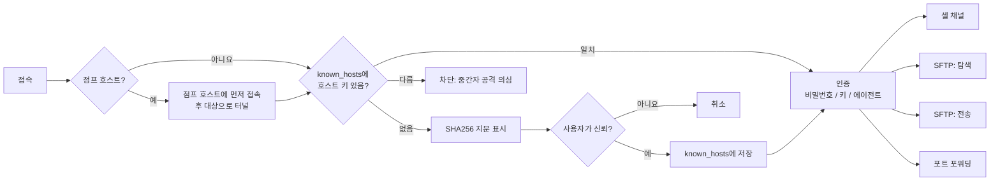
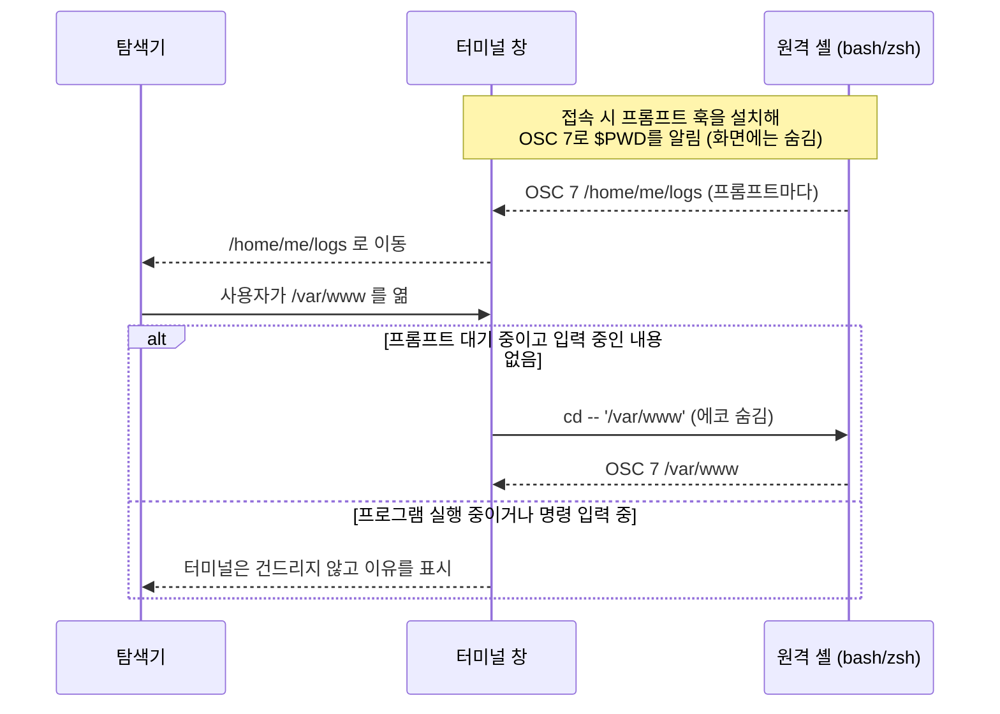

<div align="center">
  
  <br/>
  <h1>JeopsokHeyou (접속해유)</h1>

  <p><strong>Windows·macOS용 탭 SSH 터미널 + SFTP 탐색기 — 탐색기는 셸을 따라가고, 셸은 탐색기를 따라갑니다.</strong></p>

  <p><a href="README.md"></a>&nbsp;<a href="README.ko.md"></a>&nbsp;<a href="README.ja.md"></a></p>

  <p>
    <a href="https://github.com/seunghunjun/JeopsokHeyou/releases/latest"></a>
    <a href="https://github.com/seunghunjun/JeopsokHeyou/actions/workflows/ci.yml"></a>
    
    
    
    
  </p>

  
</div>

<br/>

접속해유(JeopsokHeyou)는 PuTTY·Tabby·MobaXterm·Termius를 쓰면서도 파일을 옮길 때마다 다른 프로그램을
켜야 했던 분들을 위한 가벼운 SSH/SFTP 클라이언트입니다. 계정도, 사용 통계 수집도, 클라우드도 없습니다.

## ✨ 기능

계정이 필요 없는 무료 오픈소스(GPL-3.0)입니다.

- **🏠 홈 화면** — 최근 세션이 보이는 시작 화면과 호스트·키체인·포트 포워딩·스니펫·알려진 호스트·기록 메뉴.
- **🗃️ 호스트 화면** — 그룹과 호스트를 트리와 카드로 보여 주고, 눌러서 이동할 수 있는 경로(*모든 호스트 › Production › DB*), 검색, 곳곳의 우클릭 메뉴, 오른쪽 편집 패널을 제공합니다. 검색창에 `user@host`를 입력하고 Enter를 누르면 바로 접속합니다.
- **📁 그룹과 하위 그룹** — 그룹 안에 그룹을 원하는 만큼 만들고, 세션을 드래그해서 그룹을 옮깁니다. 터미널 탭 옆에는 접고 펼 수 있는 세션 목록이 있습니다.
- **🗂️ 터미널 + SFTP 나란히** — 접속 탭마다 셸 옆에 원격 파일 탐색기가 함께 표시됩니다.
- **🔗 폴더 위치 양방향 동기화** — 터미널에서 `cd` 하면 탐색기가 따라가고, 탐색기에서 폴더를 열면 터미널이 조용히 `cd` 합니다(bash/zsh). 실행 중인 프로그램이나 입력 중인 명령에는 끼어들지 않습니다.
- **🖱️ 양방향 드래그 앤 드롭** — 탐색기/Finder에서 끌어다 놓으면 업로드, 원격 파일을 폴더 창이나 바탕화면으로 끌면 그 위치로 다운로드됩니다. 이미 있는 파일은 덮어쓰기 전에 묻습니다(덮어쓰기 / 건너뛰기 / 취소). 진행률과 취소를 지원하는 백그라운드 전송이며, 열 너비를 조절하면 기억합니다.
- **✏️ 원격 파일 로컬 편집** — 더블클릭하면 평소 쓰는 프로그램으로 열리고, 저장하면 다시 업로드할지 물어봅니다(내용이 실제로 바뀐 경우에만). "연결 프로그램" 선택도 지원합니다.
- **🪟 탭과 화면 분할** — 같은 연결에서 좌우·상하로 분할하고, 분할 창은 클릭 한 번으로 닫습니다. 창 폭이 바뀌면 긴 줄을 새 폭에 맞게 다시 나눕니다.
- **🔀 포트 포워딩** — 로컬(`-L`), 원격(`-R`), 동적 SOCKS4/5(`-D`). 세션 접속 시 함께 열거나, 터미널 없이 터널로 계속 띄워 둘 수 있습니다(자동 시작·자동 재연결·실시간 연결 수 표시).
- **🪜 점프 호스트** — 하나 이상의 경유 서버(ProxyJump)를 거쳐 접속합니다. 터미널과 터널 모두 지원합니다.
- **🔐 선택형 마스터 비밀번호** — 기본은 꺼짐. 켜면 저장된 비밀번호와 키 암호를 마스터 비밀번호로 암호화(AES-256-GCM + scrypt)하고, 한 번만 보여 주는 복구 키와 미사용 시 자동 잠금을 제공합니다.
- **🔑 키체인** — SSH 키와 저장된 비밀번호를 한곳에서 확인하고, ed25519 키를 만들고 공개키를 복사합니다.
- **⌨️ 스니펫** — 자주 쓰는 명령을 저장해 두고 터미널에 붙여넣거나 바로 실행합니다(Ctrl+Shift+P).
- **📥 클릭 한 번으로 가져오기** — **PuTTY**, **Tabby**, **MobaXterm**(MobaSSHTunnel 터널 포함), **OpenSSH config**(`~/.ssh/config`) 파일.
- **⏱️ 미사용 시 자동 접속 종료** — 세션별 또는 전체 설정, 종료 1분 전 경고, 파일 전송 중에는 끊지 않습니다.
- **🛡️ 기본이 안전** — 호스트 키 검증(처음 접속 시 확인, 바뀌면 차단)과 알려진 호스트 화면, 요청할 때만 비밀번호 저장, 개인키는 경로만 저장합니다.
- **🎨 Finder 스타일 UI** — 라이트/다크 테마, 선명한 벡터 아이콘, 한글 손글씨 글꼴(Gaegu) 선택 가능.
- **🌐 영어·한국어·일본어** — 시스템 언어를 따르고, 설정에서 언제든 바꿀 수 있습니다.
- **🍎 두 플랫폼 모두 자연스럽게** — macOS에서는 ⌘ 단축키·키체인·Finder, Windows에서는 탐색기·DPAPI·사용자별 설치를 사용합니다.

## 📸 스크린샷

<table>
  <tr>
    <td width="50%"><br/><sub><b>홈</b> — 호스트, 그룹, 모든 도구를 한 메뉴에</sub></td>
    <td width="50%"><br/><sub><b>터미널 + 탐색기</b> — 탭 하나, 연결 하나, 두 화면</sub></td>
  </tr>
  <tr>
    <td width="50%"><br/><sub><b>폴더 동기화</b> — 셸에서 <code>cd logs</code>, 탐색기는 이미 그 폴더</sub></td>
    <td width="50%"><br/><sub><b>포트 포워딩</b> — 로컬·원격·SOCKS 터널</sub></td>
  </tr>
  <tr>
    <td width="50%"><br/><sub><b>화면 분할</b> — 좌우·상하 중첩 분할</sub></td>
    <td width="50%"><br/><sub><b>다크 모드</b> — 시스템 설정을 따르거나 직접 선택</sub></td>
  </tr>
</table>

<sub>스크린샷은 영어 UI로 촬영했습니다. 실제 앱은 한국어로 표시됩니다.</sub>

## 📦 설치

[Releases](https://github.com/seunghunjun/JeopsokHeyou/releases) 페이지에서 내려받을 수 있습니다. 내려받은 파일을 확인할 수 있도록
`SHA256SUMS.txt`도 함께 제공합니다.

### Windows 10 / 11

- **설치판:** `JeopsokHeyou-<버전>-setup.exe` — 영어·한국어·일본어 중 선택, 관리자 권한 없이
  사용자별로 `%LOCALAPPDATA%\Programs\JeopsokHeyou`에 설치됩니다.
- **포터블:** `JeopsokHeyou-<버전>-win-x64.zip` — 압축을 풀고 `JeopsokHeyou.exe`를 실행합니다.
- **업데이트:** 새 설치 파일을 그대로 실행하면 기존 버전 위에 설치됩니다. 세션·저장된 비밀번호·설정은 유지됩니다.
  접속해유가 실행 중이면 설치 프로그램이 먼저 종료해 달라고 안내합니다.

> **SmartScreen:** 아직 코드 서명 전이라 "Windows의 PC 보호" 창이 뜰 수 있습니다.
> 이 저장소의 Releases 페이지에서 받은 파일일 때만 *추가 정보 → 실행*을 누르세요.
> 일부 회사 PC는 서명되지 않은 설치 파일을 아예 막습니다. 이 경우 포터블 ZIP을 쓰거나 IT 담당자에게 문의하세요.

### macOS 13 Ventura 이상

- Apple 실리콘은 `JeopsokHeyou-<버전>-macos-arm64.dmg`, Intel Mac은 `…-macos-x86_64.dmg`.
- DMG를 열고 **JeopsokHeyou**를 **응용 프로그램** 폴더로 드래그합니다(업데이트 시 **대치** 선택).

> **Gatekeeper:** 아직 Apple 공증 전입니다. 처음 실행할 때 앱을 우클릭해 **열기**를 선택하세요
> (또는 *시스템 설정 → 개인정보 보호 및 보안*에서 허용). 드래그 다운로드를 처음 쓸 때 Finder 접근 권한을 한 번 묻습니다.

### 소스에서 실행 (두 플랫폼 공통)

```bash
git clone https://github.com/seunghunjun/JeopsokHeyou.git
cd JeopsokHeyou
python3 -m venv .venv
.venv/bin/pip install -r requirements-lock.txt      # Windows: .venv\Scripts\pip
.venv/bin/python main.py                            # Windows: run.bat
```

### 제거

- **Windows:** *설정 → 앱 → 설치된 앱 → JeopsokHeyou → 제거*(또는 설치 폴더의 `Uninstall.exe` 실행).
  *세션과 설정도 함께 삭제*를 체크하면 `%APPDATA%\JeopsokHeyou`도 지웁니다. 포터블은 폴더를 지우면 됩니다.
- **macOS:** *응용 프로그램*의 **JeopsokHeyou**를 휴지통으로 옮깁니다. 데이터까지 지우려면
  `~/Library/Application Support/JeopsokHeyou`와 키체인 접근의 *JeopsokHeyou* 항목을 삭제하세요.

### 언어

UI 언어는 시스템 언어를 따릅니다(한국어·일본어 외에는 영어). **설정 → 언어**에서 바꾸거나
`--lang en|ko|ja` 옵션으로 실행할 수 있습니다.

### Termius에서 옮겨 오기

Termius는 호스트를 암호화해 저장하고 호스트 내보내기 기능이 없어서, 자동으로 가져올 수 없습니다.
**홈 → 호스트 → 새 호스트**로 등록하세요(그룹·하위 그룹도 같은 방식으로 만들 수 있습니다). 같은 서버를 `~/.ssh/config`에
정리해 두셨다면 **홈 → 호스트 → 가져오기 → OpenSSH config 가져오기…** 로 그 파일을 가져올 수 있습니다.

## ⚖️ 비교

| 기능 | 접속해유 | PuTTY | Tabby | MobaXterm Home |
| --- | --- | --- | --- | --- |
| **엔진** | Python + Qt 6 | C (네이티브) | Electron | 네이티브 (비공개 소스) |
| **탭** | ✅ | ❌ | ✅ | ✅ |
| **화면 분할** | ✅ | ❌ | ✅ | ✅ |
| **그래픽 SFTP 탐색기** | ✅ | ❌ (`psftp` CLI) | ✅ | ✅ |
| **터미널 `cd`를 탐색기가 따라감** | ✅ | ❌ | ? | ✅ |
| **탐색기를 터미널이 따라감** | ✅ | ❌ | ? | ? |
| **Windows 탐색기로 드래그 앤 드롭** | ✅ | ❌ | ? | ✅ |
| **원격 파일 편집 → 재업로드** | ✅ | ❌ | ? | ✅ |
| **포트 포워딩 (로컬 / 원격 / SOCKS)** | ✅ | ✅ | ✅ | ✅ |
| **점프 호스트** | ✅ | ✅ | ✅ | ✅ |
| **스니펫** | ✅ | ❌ | ? | ✅ |
| **PuTTY / Tabby / MobaXterm / SSH config 가져오기** | ✅ / ✅ / ✅ / ✅ | — | ? | ? |
| **미사용 시 자동 접속 종료** | ✅ | ? | ? | ? |
| **호스트 키 검증** | ✅ | ✅ | ✅ | ✅ |
| **비밀번호 저장** | 🟡 선택 (OS 보호, 선택형 마스터 비밀번호) | ❌ 의도적으로 미지원 | ✅ 볼트 | ✅ 마스터 비밀번호 |
| **X11 포워딩** | ❌ | ✅ | ✅ | ✅ |
| **시리얼 콘솔** | ❌ | ✅ | ✅ | ✅ |
| **플랫폼** | Windows, macOS | Windows, Unix | Windows, macOS, Linux | Windows |
| **UI 언어** | 영어, 한국어, 일본어 | 영어 | 다수 | ? |
| **계정 필요** | 아니요 | 아니요 | 아니요 (동기화는 선택) | 아니요 |
| **라이선스** | GPL-3.0-or-later | MIT | MIT | 독점 프리웨어 |

<sub>✅ 지원 · ❌ 미지원 · 🟡 부분 지원 · ? 확인 안 됨. 2026년 10월 기준 저희가 파악한 내용이며, 수정 제안은 풀 리퀘스트로 환영합니다.</sub>

## 🛡️ 구조와 보안

접속해유는 **로컬 전용**입니다. 사용자가 접속하는 SSH 서버하고만 통신하며, 계정·분석·자동 업데이트 서비스가 없습니다.

| 항목 | 동작 방식 |
| --- | --- |
| **데이터 위치** | Windows `%APPDATA%\JeopsokHeyou\`, macOS `~/Library/Application Support/JeopsokHeyou/` — `sessions.json`, `tunnels.json`, `snippets.json`, `history.json`, `known_hosts`, `settings.json`(마스터 비밀번호를 켜면 `vault.json`). 프로그램 폴더에는 아무것도 쓰지 않습니다. |
| **비밀번호** | *비밀번호 저장*을 체크할 때만 저장합니다. 기본은 Windows DPAPI(Windows 계정에 묶임) 또는 macOS 로그인 키체인. 마스터 비밀번호를 켜면 임의의 데이터 키로 AES-256-GCM 암호화하고, 그 키를 마스터 비밀번호와 1회용 복구 키에서 scrypt로 만든 키로 각각 감쌉니다. 비밀정보만 잠그므로 세션 목록은 그대로 보입니다. |
| **마스터 비밀번호 분실** | 복구 키로 엽니다. 둘 다 잃어버리면 *초기화*로 저장된 비밀정보만 지우며, 세션·그룹·설정은 남습니다. 뒷문은 없습니다. |
| **개인키** | 키 **경로**만 저장합니다. OpenSSH 형식(PuTTY `.ppk`는 PuTTYgen으로 변환). 키 세션에는 SSH 에이전트(Pageant/OpenSSH)도 사용합니다. 키체인 화면에서 만든 키는 `~/.ssh`에 저장되며 기존 파일을 덮어쓰지 않습니다. |
| **호스트 키** | 처음 접속할 때 SHA256 지문을 보여 주고 신뢰 여부를 묻습니다. 키가 바뀌면 접속을 **차단**합니다. 신뢰한 키는 *알려진 호스트*에서 확인·삭제할 수 있습니다. |
| **포트 포워딩** | 다른 주소를 지정하지 않으면 `127.0.0.1`에서만 대기합니다. MobaXterm에서 가져온 터널 중 모든 네트워크에서 대기하던 것은 이 PC에서만 대기하도록 바꿉니다. |
| **원격 파일 이름** | `\`, `:`, `..`, Windows 장치 이름이 들어간 이름은 정리하여, 악의적인 서버가 선택한 폴더 밖에 파일을 쓰지 못하게 합니다. |
| **임시 사본** | 편집하려고 연 파일은 시스템 임시 폴더(`JeopsokHeyou/`)에 복사되며 3일 뒤 정리됩니다. |

### 접속 과정



### 폴더 위치 양방향 동기화



## 🛠️ 개발과 빌드

준비물: Windows 10/11 또는 macOS 13 이상, Python 3.12 이상.

```bash
python -m venv .venv
.venv/bin/pip install -r requirements-lock.txt   # Windows: .venv\Scripts\pip
.venv/bin/python main.py --lang ja               # --lang en|ko|ja 로 번역 확인
.venv/bin/python tests/run_all.py                # 로컬 가짜 SSH/SFTP 서버로 화면 없이 테스트
.venv/bin/pip install pyinstaller pillow && .venv/bin/python tools/build_release.py
                                                 # Windows: setup.exe + ZIP (NSIS 3 필요), macOS: .dmg
```

푸시할 때마다 CI가 Windows와 macOS(Apple 실리콘, Intel)에서 테스트를 돌리며, `v*` 태그를 푸시하면
모든 설치 파일을 빌드해 GitHub Release 초안을 만듭니다.

- 번역은 `jeopsokheyou/locales/{ko,ja}.json`에 있습니다(원문은 영어). 누락된 문자열이 있으면 `tests/test_i18n.py`가 실패합니다.
- `tools/make_icon.py`는 여러 크기의 `app.ico`를, `tools/make_readme_media.py`는 README의 모든 이미지를 다시 만듭니다(`pip install pillow` 필요).
- 테스트 데이터에는 실제 서버가 없습니다. `tests/fixtures`는 문서용 주소(RFC 5737)만 사용합니다.

## 🧰 기술 스택

| 계층 | 기술 |
| --- | --- |
| UI | Qt 6 (PySide6), Finder 스타일 자체 테마와 SVG 아이콘 |
| 터미널 | pyte (VT100/xterm 에뮬레이션) + 자체 Qt 렌더러, IME 지원 |
| SSH / SFTP / 포워딩 | paramiko (OpenSSH 호환, 최신 알고리즘만) |
| 암호화 | cryptography / OpenSSL (AES-256-GCM, scrypt, ed25519), bcrypt, PyNaCl (paramiko 경유) |
| 비밀정보 | Windows DPAPI (`CryptProtectData`) / macOS 키체인 (`security`), 선택형 마스터 비밀번호 볼트 |
| 가져오기 | Windows 레지스트리 / `~/.putty` (PuTTY), PyYAML (Tabby), `MobaXterm.ini` / `.mxtsessions` (MobaXterm), `~/.ssh/config` (OpenSSH) |

## 🗺️ 로드맵

- 코드 서명된 Windows 설치 파일, 공증된 macOS 앱
- PuTTY `.ppk` 키 지원
- 전체 화면 프로그램(htop, mc)의 마우스 입력

## ✍️ 코드 서명 정책

현재 릴리스는 **코드 서명되지 않았습니다**. 오픈소스 프로젝트용 무료 코드 서명 프로그램인
[SignPath Foundation](https://signpath.org)에 신청했지만, 프로그램이 요구하는 공개적인 인지도가 아직 부족해 승인되지 않았습니다.
프로젝트가 더 알려지면 다시 신청할 예정입니다. 그때까지는 `SHA256SUMS.txt`로 내려받은 파일을 확인해 주세요.
자세한 정책과 팀 역할은 [영어 README의 Code signing policy](README.md#code-signing-policy)를 참고하세요.

### 개인정보 처리방침

이 프로그램은 사용자 또는 설치·운영하는 사람이 명시적으로 요청하지 않는 한 어떤 정보도 다른 네트워크 시스템으로
전송하지 않습니다. 접속해유는 사용자가 선택한 SSH/SFTP 서버에만 접속하며, 사용 통계·분석·업데이트 확인 기능이 없습니다.
함께 배포되는 외부 라이브러리(Qt/PySide6, paramiko, pyte, cryptography 등)도 데이터를 수집하거나 보내지 않습니다.

## 📄 라이선스

접속해유는 © 2026 Seunghun Jun이며, **GNU General Public License v3.0 이상**으로 배포되는 **자유 소프트웨어**입니다 —
[LICENSE](LICENSE)를 참고하세요.

- ✅ 개인·업무 어디서든 사용하고, 연구하고, 수정하고, 공유할 수 있습니다.
- 🔁 접속해유나 수정한 버전을 배포할 때는(무료든 유료든) 같은 라이선스로 배포하고 전체 소스 코드를 제공해야 합니다.
- 어떠한 보증도 없이 **"있는 그대로"** 제공됩니다.

GitHub의 모든 릴리스는 태그된 소스에서 GitHub Actions로 빌드되며, 해당 버전의 소스 코드가 릴리스에 첨부됩니다.

외부 라이브러리(Qt/PySide6, paramiko, pyte 등)와 Gaegu 글꼴은 각자의 라이선스를 따르며 모두 GPL-3.0과 호환됩니다 —
[THIRD-PARTY-NOTICES.md](THIRD-PARTY-NOTICES.md)와 [licenses/](licenses/)를 참고하세요. 앱 아이콘은 ChatGPT로 만들었고,
나머지 아이콘은 직접 그린 SVG입니다.

PuTTY, Tabby, MobaXterm, Termius, Windows, macOS, Finder는 각 소유자의 상표입니다. 접속해유는 독립 프로젝트이며
이들과 관계가 없습니다.

## 🤝 기여와 보안

기여를 환영합니다 — [CONTRIBUTING.md](CONTRIBUTING.md)를 참고하세요. 취약점은 [SECURITY.md](SECURITY.md)에 안내된 대로
비공개로 알려 주시고, 이슈에 비밀번호·키·실제 서버 주소를 올리지 마세요.
