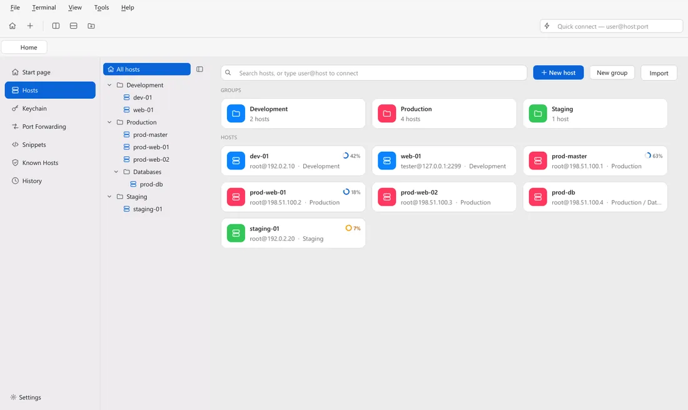
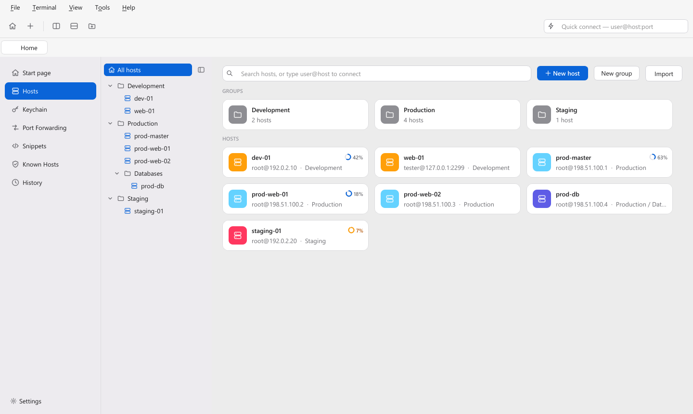
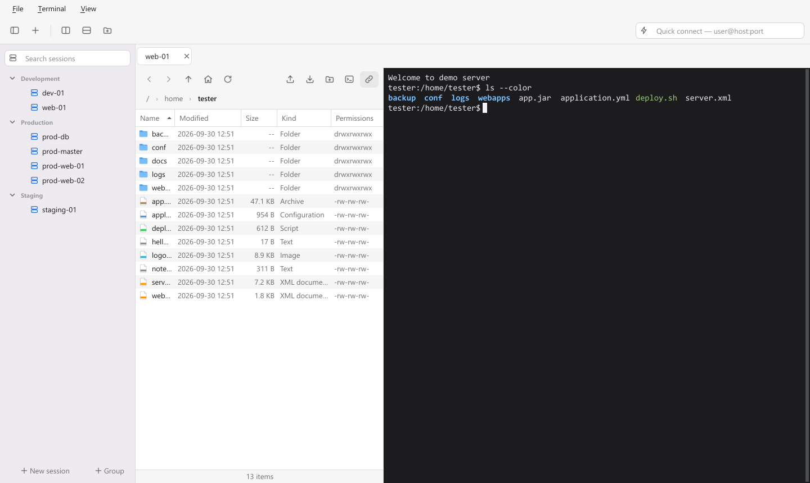
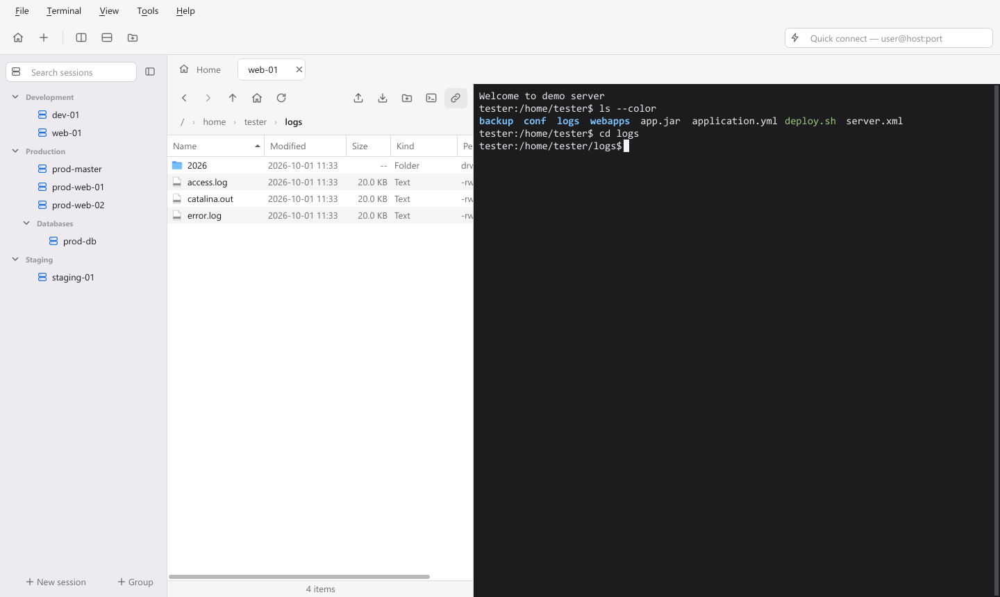
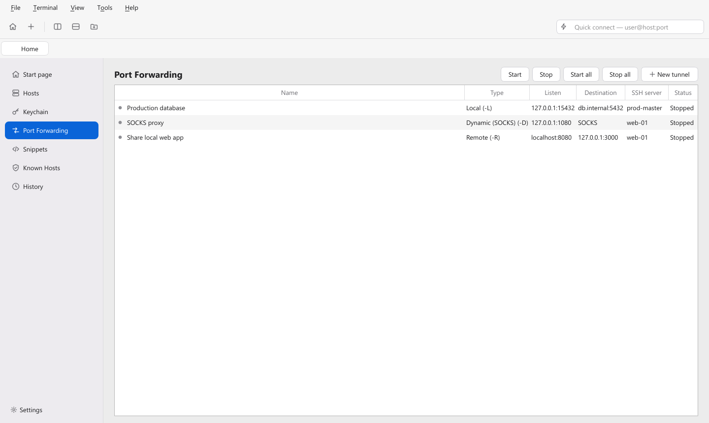
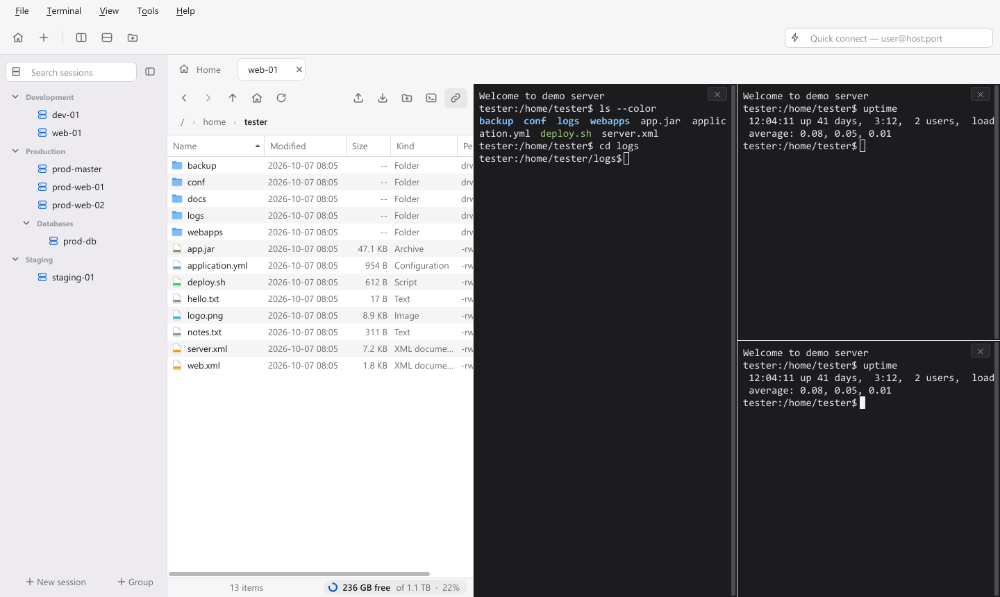
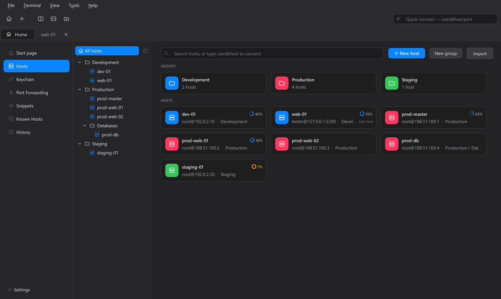
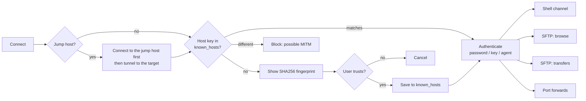
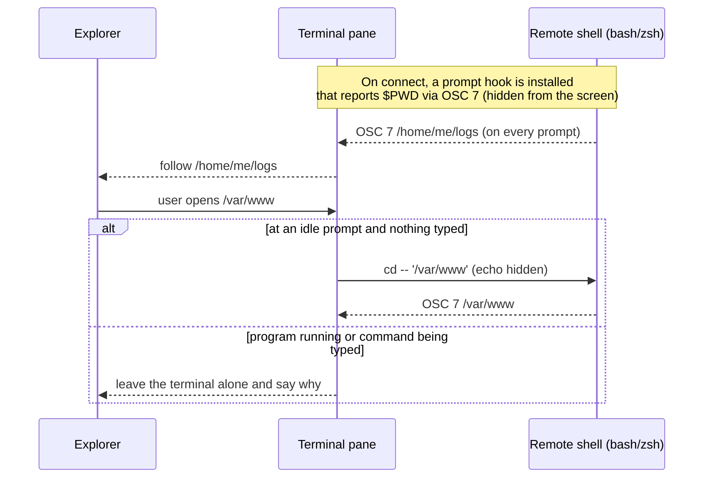

<div align="center">
  
  <br/>
  <h1>JeopsokHeyou</h1>

  <p><strong>A tabbed SSH terminal and SFTP explorer for Windows and macOS — the file browser follows your shell, and your shell follows the file browser.</strong></p>

  <p><a href="README.md"></a>&nbsp;<a href="README.ko.md"></a>&nbsp;<a href="README.ja.md"></a></p>

  <p>
    <a href="https://github.com/seunghunjun/JeopsokHeyou/releases/latest"></a>
    <a href="https://github.com/seunghunjun/JeopsokHeyou/actions/workflows/ci.yml"></a>
    
    
    
    
    
    
    
  </p>

  
</div>

<br/>

JeopsokHeyou (pronounced *jup-sok-hae-yu*, a playful Korean way of saying "let's connect") is a
lightweight SSH/SFTP client built for people who live in PuTTY, Tabby, MobaXterm or Termius but keep
switching to a separate program to move files. No account, no telemetry, no cloud.

## ✨ Features

No account required. Free and open source (GPL-3.0).

- **🏠 Home screen** — the start page with your recent sessions, plus a menu for Hosts, Keychain, Port Forwarding, Snippets, Known Hosts and History.
- **🗃️ Hosts screen** — groups and hosts as a tree and as cards, a clickable path (*All hosts › Production › DB*), search, right-click menus everywhere and a side panel for editing. Type `user@host` in the search box to connect right away.
- **📁 Groups and subgroups** — nest groups as deep as you like; drag sessions between groups; a collapsible session list sits next to every terminal tab.
- **🗂️ Terminal + SFTP side by side** — every connection tab shows a remote file explorer next to the shell.
- **🔗 Two-way folder sync** — `cd` in the terminal and the explorer follows; open a folder in the explorer and the terminal quietly `cd`s there (bash/zsh). It never types into a running program or over a half-written command.
- **🖱️ Drag & drop both ways** — drop files from Explorer or Finder to upload; drag remote files onto a folder window or the desktop to download there. Asks before overwriting a file that already exists (overwrite / skip / cancel). Background transfers with progress and cancel; resizable columns that remember their widths.
- **✏️ Edit remote files locally** — double-click to open in your usual app; save and JeopsokHeyou offers to upload the change (only when the content really changed). "Open with…" is built in.
- **🪟 Tabs & split panes** — split left/right or top/bottom on the same connection, close any pane with one click.
- **🔀 Port forwarding** — local (`-L`), remote (`-R`) and dynamic SOCKS4/5 (`-D`) forwards, opened with a session or kept running on their own as tunnels with autostart, automatic reconnect and live connection counts.
- **🪜 Jump hosts** — connect through one or more bastion servers (ProxyJump), for terminals and tunnels alike.
- **🔐 Optional master password** — off by default; when on, saved passwords and key passphrases are encrypted with it (AES-256-GCM + scrypt), with a one-time recovery key and auto-lock when idle.
- **🔑 Keychain** — see your SSH keys and saved passwords in one place, generate an ed25519 key and copy its public key.
- **⌨️ Snippets** — save frequently used commands and paste or run them in the terminal (Ctrl+Shift+P).
- **📥 One-click import** — sessions from **PuTTY**, **Tabby**, **MobaXterm** (including MobaSSHTunnel tunnels) and **OpenSSH config** (`~/.ssh/config`) files.
- **⏱️ Idle auto-disconnect** — per session or global, with a one-minute warning; never disconnects during a transfer.
- **🛡️ Safe by default** — host-key verification (trust on first use, block on mismatch) with a Known Hosts screen, passwords not saved unless you ask, private keys referenced by path only.
- **🎨 Finder-style UI** — light and dark themes, crisp vector icons, Korean handwriting font (Gaegu) as an option.
- **🌐 English, Korean and Japanese** — follows the system language; switch anytime in Settings.
- **🍎 Native on both platforms** — ⌘ shortcuts, Keychain and Finder on macOS; Explorer, DPAPI and a per-user installer on Windows.

## 📸 Screenshots

<table>
  <tr>
    <td width="50%"><br/><sub><b>Home</b> — hosts, groups and every tool in one menu</sub></td>
    <td width="50%"><br/><sub><b>Terminal + explorer</b> — one tab, one connection, both views</sub></td>
  </tr>
  <tr>
    <td width="50%"><br/><sub><b>Folder sync</b> — <code>cd logs</code> in the shell, the explorer is already there</sub></td>
    <td width="50%"><br/><sub><b>Port forwarding</b> — local, remote and SOCKS tunnels</sub></td>
  </tr>
  <tr>
    <td width="50%"><br/><sub><b>Split panes</b> — nested left/right and top/bottom splits</sub></td>
    <td width="50%"><br/><sub><b>Dark mode</b> — follows the system or pick it yourself</sub></td>
  </tr>
</table>

## 📦 Install

Downloads are published on the [Releases](https://github.com/seunghunjun/JeopsokHeyou/releases) page, together with a `SHA256SUMS.txt`
file so you can verify what you downloaded.

### Windows 10 / 11

- **Installer:** `JeopsokHeyou-<version>-setup.exe` — choose English, Korean or Japanese; installs per user
  (no administrator rights) to `%LOCALAPPDATA%\Programs\JeopsokHeyou`.
- **Portable:** `JeopsokHeyou-<version>-win-x64.zip` — unzip and run `JeopsokHeyou.exe`.
- **Updating:** run the new installer over the old version. Your sessions, saved passwords and settings are kept.
  If JeopsokHeyou is still running, the installer asks you to close it first.

> **SmartScreen:** the builds are not code-signed yet, so Windows may show "Windows protected your PC".
> Choose *More info → Run anyway* only if you downloaded the file from this repository's Releases page.
> Some corporate PCs block unsigned installers entirely — use the portable ZIP or ask your IT team.

### macOS 13 Ventura or later

- `JeopsokHeyou-<version>-macos-arm64.dmg` for Apple silicon, `…-macos-x86_64.dmg` for Intel Macs.
- Open the DMG and drag **JeopsokHeyou** to **Applications** (choose **Replace** when updating).

> **Gatekeeper:** the builds are not notarized by Apple yet. On first launch, right-click the app and
> choose **Open** (or allow it in *System Settings → Privacy & Security*). Drag-to-download asks once
> for permission to query Finder.

### From source (both platforms)

```bash
git clone https://github.com/seunghunjun/JeopsokHeyou.git
cd JeopsokHeyou
python3 -m venv .venv
.venv/bin/pip install -r requirements-lock.txt      # Windows: .venv\Scripts\pip
.venv/bin/python main.py                            # Windows: run.bat
```

### Uninstall

- **Windows:** *Settings → Apps → Installed apps → JeopsokHeyou → Uninstall* (or run `Uninstall.exe` in the
  install folder). Tick *Also delete my sessions and settings* to remove `%APPDATA%\JeopsokHeyou` too.
  For the portable ZIP, delete the folder.
- **macOS:** drag **JeopsokHeyou** from *Applications* to the Trash. To remove your data as well, delete
  `~/Library/Application Support/JeopsokHeyou` and the *JeopsokHeyou* items in Keychain Access.

### Language

The UI language follows the system language (English is used for anything other than Korean or
Japanese). Change it in **Settings → Language**, or start with `--lang en|ko|ja`.

### Coming from Termius

Termius keeps its hosts encrypted and has no host export, so they cannot be imported automatically.
Add them under **Home → Hosts → New host** (groups and subgroups work the same way), or, if you keep the
same servers in `~/.ssh/config`, import that file with **Home → Hosts → Import → Import OpenSSH config…**.

## ⚖️ Comparison

| Feature | JeopsokHeyou | PuTTY | Tabby | MobaXterm Home |
| --- | --- | --- | --- | --- |
| **Engine** | Python + Qt 6 | C (native) | Electron | Native (closed source) |
| **Tabs** | ✅ | ❌ | ✅ | ✅ |
| **Split panes** | ✅ | ❌ | ✅ | ✅ |
| **Graphical SFTP browser** | ✅ | ❌ (`psftp` CLI) | ✅ | ✅ |
| **Explorer follows terminal `cd`** | ✅ | ❌ | ? | ✅ |
| **Terminal follows explorer** | ✅ | ❌ | ? | ? |
| **Drag & drop to Windows Explorer** | ✅ | ❌ | ? | ✅ |
| **Edit remote file → re-upload** | ✅ | ❌ | ? | ✅ |
| **Port forwarding (local / remote / SOCKS)** | ✅ | ✅ | ✅ | ✅ |
| **Jump hosts** | ✅ | ✅ | ✅ | ✅ |
| **Snippets** | ✅ | ❌ | ? | ✅ |
| **Import PuTTY / Tabby / MobaXterm / SSH config** | ✅ / ✅ / ✅ / ✅ | — | ? | ? |
| **Idle auto-disconnect** | ✅ | ? | ? | ? |
| **Host-key verification** | ✅ | ✅ | ✅ | ✅ |
| **Saved passwords** | 🟡 optional (OS-protected, optional master password) | ❌ by design | ✅ vault | ✅ master password |
| **X11 forwarding** | ❌ | ✅ | ✅ | ✅ |
| **Serial console** | ❌ | ✅ | ✅ | ✅ |
| **Platforms** | Windows, macOS | Windows, Unix | Windows, macOS, Linux | Windows |
| **UI languages** | EN, KO, JA | EN | many | ? |
| **Account required** | No | No | No (sync optional) | No |
| **License** | GPL-3.0-or-later | MIT | MIT | Proprietary freeware |

<sub>✅ yes · ❌ no · 🟡 partial · ? not verified. Based on our understanding in October 2026 — corrections are welcome via pull request.</sub>

## 🛡️ Architecture & Security

JeopsokHeyou is **local-only**: it talks to the SSH servers you connect to and nothing else —
no account, no analytics, no auto-update service.

| Topic | How it works |
| --- | --- |
| **Where data lives** | Windows `%APPDATA%\JeopsokHeyou\`, macOS `~/Library/Application Support/JeopsokHeyou/` — `sessions.json`, `tunnels.json`, `snippets.json`, `history.json`, `known_hosts`, `settings.json` (and `vault.json` when a master password is set). Nothing is written next to the program. |
| **Passwords** | Not saved unless you tick *Save password*. By default: Windows DPAPI (bound to your Windows account) or your macOS login Keychain. With the optional master password: AES-256-GCM with a random data key, wrapped by scrypt-derived keys from the master password and from a one-time recovery key. Only secrets are locked — the session list stays readable. |
| **Master password lost** | Unlock with the recovery key. If both are lost, *Reset* deletes only the saved secrets; sessions, groups and settings stay. There is no back door. |
| **Private keys** | Only the key **path** is stored. OpenSSH format (convert PuTTY `.ppk` with PuTTYgen). SSH agent (Pageant/OpenSSH) is used for key sessions. Keys generated in the Keychain screen are written to `~/.ssh` and never overwrite an existing file. |
| **Host keys** | Trust on first use with the SHA256 fingerprint shown; a changed key **blocks** the connection. Trusted keys can be reviewed and removed in *Known Hosts*. |
| **Port forwarding** | Listens on `127.0.0.1` unless you choose another address. Imported MobaXterm tunnels that listened on all interfaces are switched to this PC only. |
| **Remote file names** | Names containing `\`, `:`, `..` or Windows device names are sanitised so a malicious server cannot write outside the chosen folder. |
| **Temporary copies** | Files opened for editing are copied to the system temp folder (`JeopsokHeyou/`) and cleaned up after 3 days. |

### Connecting



### Two-way folder sync



## 🛠️ Development & Build

Prerequisites: Windows 10/11 or macOS 13+, Python 3.12+.

```bash
python -m venv .venv
.venv/bin/pip install -r requirements-lock.txt   # Windows: .venv\Scripts\pip
.venv/bin/python main.py --lang ja               # --lang en|ko|ja to test translations
.venv/bin/python tests/run_all.py                # headless tests against a local fake SSH/SFTP server
.venv/bin/pip install pyinstaller pillow && .venv/bin/python tools/build_release.py
                                                 # Windows: setup.exe + ZIP (needs NSIS 3); macOS: .dmg
```

Continuous integration runs the test suite on Windows and macOS (Apple silicon and Intel) for every
push; pushing a `v*` tag builds all installers and drafts a GitHub Release.

- Translations live in `jeopsokheyou/locales/{ko,ja}.json` (English is the source language). `tests/test_i18n.py` fails if a string is missing.
- `tools/make_icon.py` builds the multi-size `app.ico`; `tools/make_readme_media.py` regenerates every image in this README (needs `pip install pillow`).
- Test data never contains real servers: `tests/fixtures` uses documentation-only addresses (RFC 5737).

## 🧰 Tech Stack

| Layer | Tech |
| --- | --- |
| UI | Qt 6 via PySide6, custom Finder-style theme and SVG icons |
| Terminal | pyte (VT100/xterm emulation) with a custom Qt renderer, IME support |
| SSH / SFTP / forwarding | paramiko (OpenSSH-compatible, modern algorithms only) |
| Crypto | cryptography / OpenSSL (AES-256-GCM, scrypt, ed25519), bcrypt, PyNaCl (via paramiko) |
| Secrets | Windows DPAPI (`CryptProtectData`) / macOS Keychain (`security`), optional master-password vault |
| Import | Windows registry / `~/.putty` (PuTTY), PyYAML (Tabby), `MobaXterm.ini` / `.mxtsessions` (MobaXterm), `~/.ssh/config` (OpenSSH) |

## 🗺️ Roadmap

- Code-signed Windows installer and notarized macOS app
- PuTTY `.ppk` key support
- Mouse reporting for full-screen programs (htop, mc) and line reflow on resize

<a id="code-signing-policy"></a>

## ✍️ Code signing policy

Current releases are **not code-signed**. The project applied to the
[SignPath Foundation](https://signpath.org) free code signing program for open source projects; the
application was not approved yet because the program requires more public adoption, and we plan to
reapply once the project is better known. Until then, verify downloads with `SHA256SUMS.txt`.

Once releases are signed:

- Only JeopsokHeyou's own binaries are signed (`JeopsokHeyou.exe`, the installer and the uninstaller);
  third-party libraries are shipped unmodified from their upstream projects.
- Every release is built from a tagged commit by GitHub Actions, and every signing request is approved manually.

**Team roles**

| Role | Members |
| --- | --- |
| Committers and reviewers | [Seunghun Jun](https://github.com/seunghunjun) |
| Approvers | [Seunghun Jun](https://github.com/seunghunjun) |

### Privacy policy

This program will not transfer any information to other networked systems unless specifically requested
by the user or the person installing or operating it. JeopsokHeyou only connects to the SSH/SFTP servers
you choose; it has no telemetry, analytics or update checks. The bundled third-party libraries
(Qt/PySide6, paramiko, pyte, cryptography, …) do not collect or send data either.

## 📄 Licensing

JeopsokHeyou is © 2026 Seunghun Jun and **free software** released under the
**GNU General Public License v3.0 or later** — see [LICENSE](LICENSE).

- ✅ Use it anywhere (personally or at work), study it, change it and share it.
- 🔁 If you distribute JeopsokHeyou or a modified version — for free or for a fee — you must
  do so under the same license and give your users the complete corresponding source code.
- Provided **"as is"**, without warranty of any kind.

Every release on GitHub is built from the tagged source by GitHub Actions, and the source code for
that exact version is attached to the release.

Third-party libraries (Qt/PySide6, paramiko, pyte, …) and the Gaegu font keep their own licenses,
all compatible with GPL-3.0 — see [THIRD-PARTY-NOTICES.md](THIRD-PARTY-NOTICES.md) and
[licenses/](licenses/). The app icon was generated with ChatGPT; all other icons are original SVGs.

PuTTY, Tabby, MobaXterm, Termius, Windows, macOS and Finder are trademarks of their respective owners.
JeopsokHeyou is an independent project and is not affiliated with them.

## 🤝 Contributing & Security

Contributions are welcome — see [CONTRIBUTING.md](CONTRIBUTING.md). Please report vulnerabilities
privately as described in [SECURITY.md](SECURITY.md), and never post passwords, keys or real server
addresses in issues.
